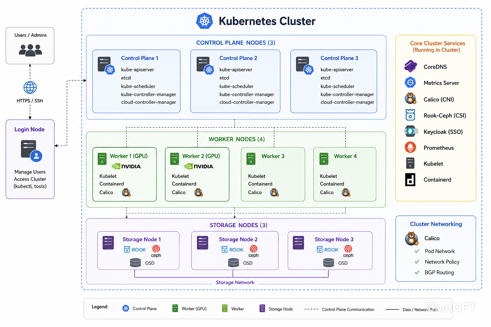
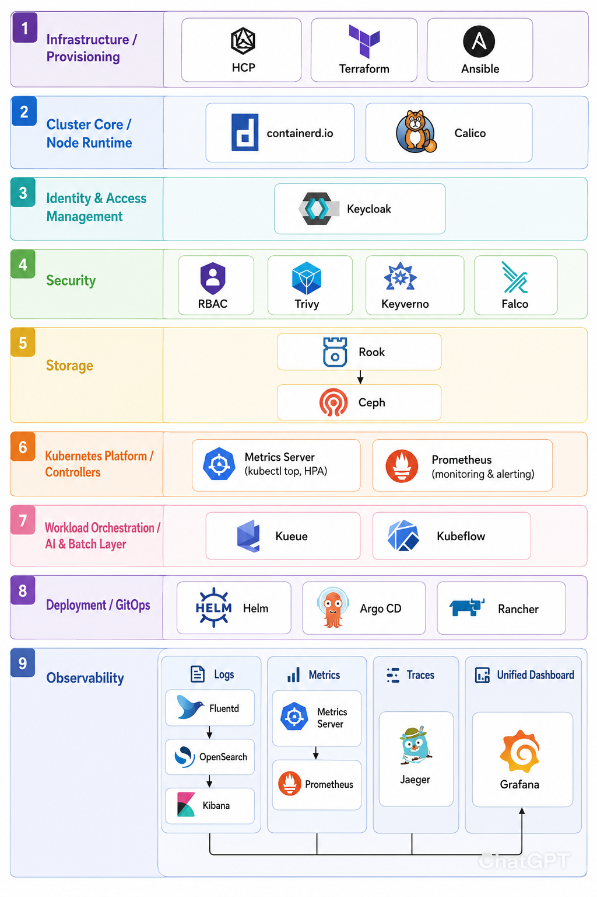

Kubernetes HPC Platform Architecture
====================================

This document describes the architecture of a Kubernetes-based HPC and AI platform consisting of:

* 3 Kubernetes Control Plane Nodes
* 4 Kubernetes Worker Nodes
* 2 GPU Worker Nodes
* 2 Standard Worker Nodes
* 1 Login Node
* 3 Storage Nodes running Rook-Ceph

Software Components
-------------------

1. Infrastructure / Provisioning
~~~~~~~~~~~~~~~~~~~~~~~~~~~~~~~~

This layer is responsible for building and configuring the underlying infrastructure that hosts the Kubernetes cluster.

**HCP (HashiCorp Cloud Platform)**: Managed platform services that simplify infrastructure operations and integrate with HashiCorp tooling.

**Terraform**: Infrastructure-as-Code (IaC) tool used to provision cloud infrastructure such as networks, compute instances, and cluster foundations 
in a declarative and reproducible way.

**Ansible**: Configuration management tool used to bootstrap nodes, install dependencies, and enforce consistent system-level configuration across 
all machines.

2. Cluster Core / Node Runtime
~~~~~~~~~~~~~~~~~~~~~~~~~~~~~~

This layer defines the fundamental runtime environment for Kubernetes worker and control plane nodes.

**containerd.io**: Container runtime responsible for pulling images, managing container lifecycle, and executing workloads efficiently on each node.

**Calico**: Provides networking, routing, and network policy enforcement for Kubernetes, enabling secure and scalable pod-to-pod communication.

3. Identity & Access Management
~~~~~~~~~~~~~~~~~~~~~~~~~~~~~~~

**Keycloak**: Centralized identity and access management system providing authentication, authorization, Single Sign-On (SSO), and integration 
with OAuth2/OpenID Connect for Kubernetes and applications.

4. Security
~~~~~~~~~~~

Security tooling ensures cluster integrity, workload safety, and runtime protection.

**RBAC (Role-Based Access Control)**: Native Kubernetes authorization mechanism that defines fine-grained access policies for users, groups, 
and service accounts.

**Trivy**: Vulnerability scanner used to detect security issues in container images, Kubernetes manifests, and filesystem dependencies.

**Kyverno**: Policy engine for Kubernetes that validates, mutates, and generates resources based on organizational security and compliance requirements.

**Falco**: Runtime security monitoring tool that detects abnormal system behavior and suspicious activity inside containers using syscall analysis.

5. Storage
~~~~~~~~~~

This layer provides persistent and distributed storage for stateful workloads.

**Rook**: Kubernetes operator that automates deployment, scaling, and management of storage systems.

**Ceph**: Distributed storage system providing block, object, and file storage with high availability, scalability, and fault tolerance.

6. Kubernetes Platform / Controllers
~~~~~~~~~~~~~~~~~~~~~~~~~~~~~~~~~~~~

Core cluster services responsible for scaling, scheduling, and resource management.

**Metrics Server**: Collects resource usage metrics from nodes and pods, enabling features such as:

* ``kubectl top``

* Horizontal Pod Autoscaler (HPA)

**Prometheus**: Monitoring and alerting system that scrapes and stores metrics from Kubernetes workloads and infrastructure components.

7. Workload Orchestration / AI & Batch Layer
~~~~~~~~~~~~~~~~~~~~~~~~~~~~~~~~~~~~~~~~~~~~

This layer handles batch scheduling, AI workloads, and large-scale distributed compute jobs.

**Kueue**: Batch scheduling system designed to manage queued workloads and ensure fair resource allocation across jobs.

**Kubeflow**: Machine learning platform for building, training, and deploying end-to-end ML pipelines on Kubernetes.

8. Deployment / GitOps
~~~~~~~~~~~~~~~~~~~~~~

This layer automates application deployment and ensures cluster state consistency.

**Helm**: Package manager for Kubernetes used to define, install, and manage applications using reusable charts.

**Argo CD**: GitOps continuous delivery tool that continuously reconciles cluster state with Git repository definitions.

**Rancher**: Multi-cluster Kubernetes management platform providing centralized UI and governance for cluster operations.

9. Observability
~~~~~~~~~~~~~~~~

This layer provides full-stack visibility across logs, metrics, and traces.

Logs
^^^^

**Fluentd**: Log collection and forwarding agent that aggregates logs from nodes and containers.

**OpenSearch**: Distributed search and analytics engine used for storing, indexing, and querying logs.

**Kibana**: Visualization interface used to explore and analyze log data.

Metrics
^^^^^^^

**Metrics Server**: Lightweight metrics provider for autoscaling and basic resource monitoring.

**Prometheus**: Central metrics system used for alerting, dashboards, and long-term metric storage.

Traces
^^^^^^

**Jaeger**: Distributed tracing system used to track requests across microservices and diagnose latency bottlenecks.

Unified Dashboard
^^^^^^^^^^^^^^^^^

**Grafana**: Central visualization platform that integrates metrics, logs, and traces into unified dashboards.

Platform Summary
----------------

The platform combines:

* High Availability Kubernetes Control Plane (3 nodes)
* GPU-accelerated compute for AI/ML workloads
* Distributed Rook-Ceph storage
* Enterprise authentication through Keycloak
* Security through RBAC, Trivy, Kyverno, and Falco
* GitOps-driven deployment using Argo CD
* Batch scheduling with Kueue
* Machine learning workflows through Kubeflow
* Full observability with Prometheus, Grafana, Fluentd, OpenSearch, Kibana, and Jaeger

This architecture provides a scalable, secure, and production-ready Kubernetes platform suitable for HPC, AI, machine learning, and research 
computing environments.